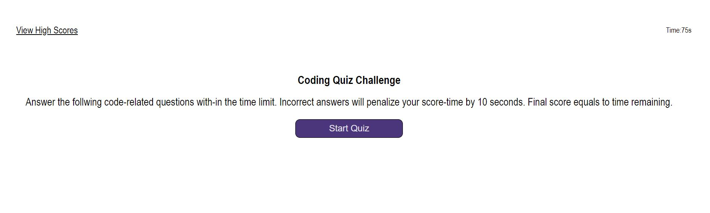
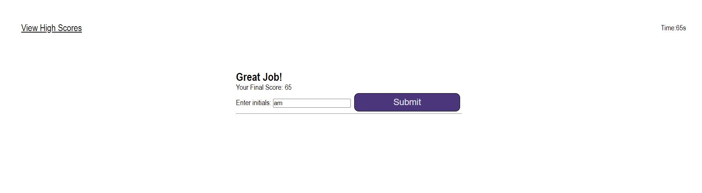
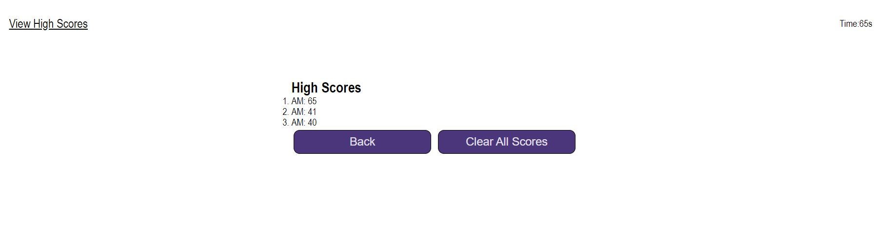

# Code-Quiz
Module 4 Challenge

## Description
This site was created for coding boot camp student to be able to take a timed quiz on JavaScript fundemetals and track progress and compare to others.

## Usage
To open the site click on the following link.

Below is a preview of the site.

To start the quick, click on start quiz. 

Then you will be presented with a series of questions.

Answer each question and results will be displayed at the bottom.

At the end of the quiz enter your initials and submit them. This will save your score.

To restart the quiz again, click on the back button and it will take you to the beginning page.

## Credits
References:\
https://github.com/kkarrwrites/boot-camp-module-04-challenge-code-quiz/blob/main/index.html \
https://github.com/vpham26/Web-API-Code-Quiz-Challenge-/blob/main/assets/js/script.js \
https://developer.mozilla.org/en-US/docs/Web/API/Document/createElement \
https://www.geeksforgeeks.org/how-to-create-a-simple-javascript-quiz/ \
ChatGPT

Debug:\
ChatGPT

